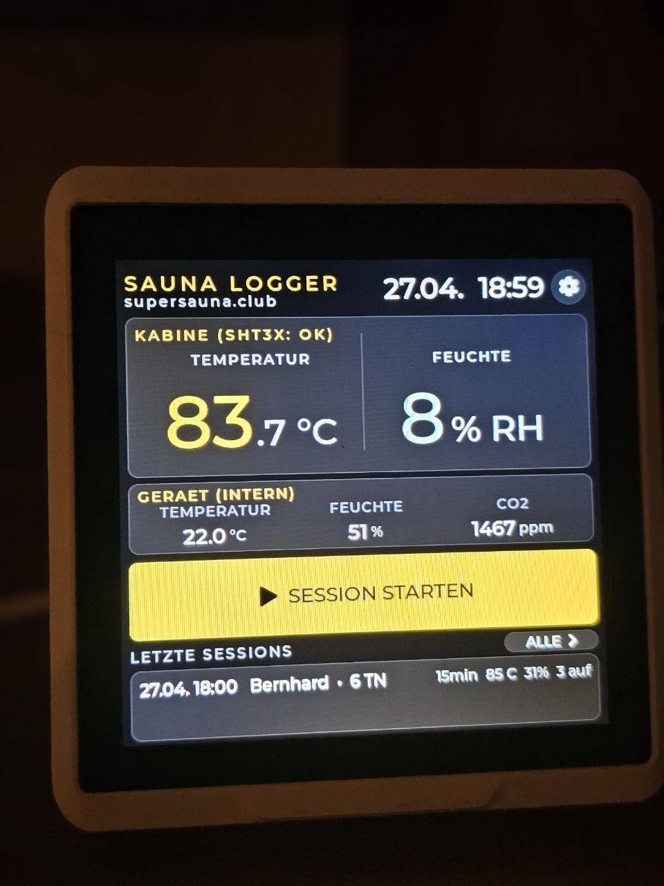
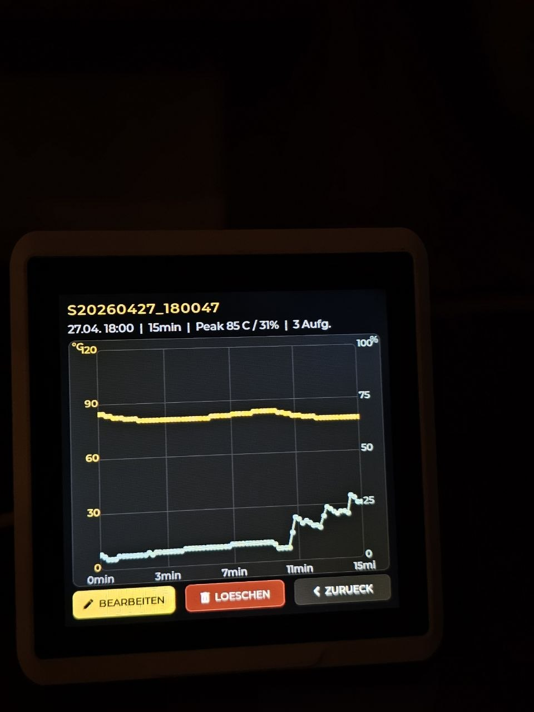
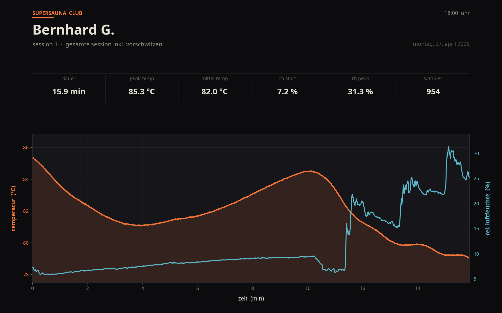

<div align="center">


# sscsaunalogger

**Open-Source-Datenlogger für die finnische Sauna**

Ein autarkes Mess- und Aufzeichnungsgerät, das Kabinentemperatur und Luftfeuchte mit 2 Hz aufzeichnet — direkt am Gerät bedienbar, ohne App, ohne Cloud-Zwang. Aufzeichnung lokal als CSV auf SD-Karte, optional Push in eine MariaDB.

[Schnellstart](#schnellstart) · [Hardware](#hardware) · [Architektur](#architektur) · [Bedienung](#bedienung) · [Lizenz](#lizenz)

[](LICENSE)
[](https://www.seeedstudio.com/SenseCAP-Indicator-D1S-p-5643.html)
[](https://docs.espressif.com/projects/esp-idf/en/v5.1/esp32s3/index.html)

<br/>



<sub><i>Home-Screen während aktiver Session auf einem D1S: Kabinen-Temperatur 83,7 °C, links daneben die Vorraum-Kachel mit CO₂ aus dem internen SCD41 (auf einem D1 fehlt diese Kachel), vorherige Session „Bernhard · 6 TN" in der History.</i></sub>

<br/><br/>



<sub><i>Detail-Chart auf dem Gerät: 15-min-Session aus der v0.2.x-Zeit (drei manuelle Aufguss-Marker als Spikes sichtbar) — direkt am Display mit Buttons für BEARBEITEN, LÖSCHEN und ZURÜCK. Seit v0.3.1 wird ohne Live-Aufguss-Button aufgezeichnet, die charakteristischen RH-/Temp-Spikes bleiben in der Roh-CSV trotzdem erhalten und sehen identisch aus, nur ohne benannte Marker.</i></sub>

<br/><br/>



<sub><i>Dieselben Daten als Web-Visualisierung (mit `tools/csv_to_chart.py` gerendert) — Peak 85,3 °C, mittlere Temperatur 82,0 °C, drei Aufgüsse über 15,9 min mit charakteristischem Feuchte-Anstieg auf 31,3 % RH.</i></sub>

</div>

---

## Inhalt

- [Überblick](#überblick)
- [Funktionen](#funktionen)
- [Hardware](#hardware)
  - [Komponenten](#komponenten)
  - [Messbereich](#messbereich)
  - [Pin-Belegung](#pin-belegung)
  - [Anschluss der Sauna-Probe](#anschluss-der-sauna-probe)
- [Schnellstart](#schnellstart)
  - [Linux](#linux)
  - [macOS](#macos)
  - [Windows](#windows)
- [Architektur](#architektur)
  - [Zwei-Prozessor-Aufbau](#zwei-prozessor-aufbau)
  - [UART-Protokoll](#uart-protokoll)
  - [Quellcode-Aufteilung](#quellcode-aufteilung)
- [Bedienung](#bedienung)
- [Datenformat](#datenformat)
- [Robustheit & Diagnose](#robustheit--diagnose)
- [Roadmap](#roadmap)
- [Troubleshooting](#troubleshooting)
- [Mitwirken](#mitwirken)
- [Lizenz](#lizenz)

---

## Überblick

Der **sscsaunalogger** ist eine Saunabetreiber-orientierte Firmware für den **SenseCAP Indicator D1/D1S**, eine Hardware-Plattform mit ESP32-S3-Hauptprozessor, RP2040-Sensor-Koprozessor, 4-Zoll-Touchdisplay und SD-Kartenslot. Aus der allgemeinen Indikator-Plattform wird damit ein dediziertes Aufzeichnungsgerät für Saunagänge.

Das Gerät steht im **Vorraum** der Sauna. Ein Kabinen-Fühler — ein Sensirion SHT35 in einer IP68-Edelstahlhülle mit 2 m Silikon-Anschlusskabel — hängt durch die Wand in der Kabine und liefert Messwerte vom heißen Bereich. Auf der **D1S-Variante** kommen zusätzlich CO₂ (SCD41) und VOC (SGP40) aus den werkseitig verbauten Vorraum-Sensoren dazu; auf der einfacheren **D1-Variante** fehlen diese Sensoren komplett, der Logger arbeitet dann nur mit den Kabinen-Werten.

Eine **Session** beginnt mit einem Druck auf `START` am Display und endet mit `STOPPEN`. Während der Session werden Messwerte mit **2 Hz dauerhaft** (alle 500 ms) erfasst und auf die SD-Karte geschrieben — kein Boost-Modus, kein manueller Aufguss-Button, keine Unterbrechung der Auflösung. Nach dem Stoppen wird ein Formular für Saunameister, Teilnehmerzahl, Aufguss-Anzahl und Notizen gezeigt, und die Session-Metadaten landen in der Geräte-Historie.

## Funktionen

- **2-Hz-Dauer-Aufzeichnung** von Kabinentemperatur und Luftfeuchte über die ganze Session — keine Boost-Phasen, keine Modus-Umschaltung. Aufgüsse werden post-hoc als Anzahl im Save-Formular eingetragen, die charakteristischen RH/Temp-Spikes bleiben in der Roh-CSV erhalten und sind im Detail-Chart gut sichtbar.
- **Touch-bedienbares UI** mit Live-Kurve, History-Liste, Detail-Charts und kategorisierten Settings-Submenüs — komplett offline ohne Smartphone bedienbar.
- **Detail-Chart-Puffer:** 7200 Slots im PSRAM, das deckt eine Stunde durchgehend in voller 2-Hz-Auflösung ab.
- **Hybride Speicher-Architektur:** SD-Karte ist Quelle der Wahrheit (Roh-CSV + JSON-Sidecar pro Session), ESP32-NVS dient als schneller Cache für die Geräte-Historie. Verlorenes NVS lässt sich jederzeit per Knopfdruck aus der SD wiederherstellen.
- **Saunameister-Verwaltung** mit Stammgäste-Liste; häufige Operatoren werden im Dropdown automatisch nach oben sortiert.
- **MariaDB-Export** mit Auto-CREATE-TABLE und 100er-Batch-Inserts (optional, in Settings konfigurierbar).
- **USB-CDC-Datenexport** am RP2040 (`?L`, `?D <id>`) — Session-CSVs ohne SD-Karten-Entnahme zum Host kopieren.
- **NTP-Zeitsynchronisation** mit Europe/Vienna-Default (DST-aware) und manuellem Setz-Modal als Fallback ohne WLAN.
- **PWM-Display-Helligkeit** (5–100 %) per Slider live einstellbar, Wert NVS-persistent.
- **Crash-Diagnose direkt am Display** — Boot-Counter und Reset-Reason beider Prozessoren, Heap-Status und Zeit-Quelle in der Diagnose-Section sichtbar.
- **Watchdog-gesicherte Sensor-Firmware** auf dem RP2040 mit I²C-Bus-Recovery und Sanity-Range-Checks gegen geglitchte Werte.

## Hardware

### Komponenten

| Komponente | Details |
|---|---|
| Hauptboard | Seeed [SenseCAP Indicator D1 oder D1S](https://www.seeedstudio.com/SenseCAP-Indicator-D1S-p-5643.html) — ESP32-S3 (240 MHz Dual-Core, 8 MB Flash, Octal-PSRAM), RP2040 (Dual-Cortex-M0+ @ 133 MHz), 4″ IPS 480×480 Touchdisplay (FT6336U) |
| Externer Sauna-Fühler | Sensirion **SHT35** in IP68-Edelstahlhülle mit fest angegossenem 2 m Silikon-Kabel (200 °C-rated). Im Handel meist als „FS400-SHT35" angeboten. I²C-Adresse `0x44`. |
| Interne Vorraum-Sensoren | **Nur D1S:** Sensirion **SCD41** (CO₂ + T + RH @ `0x62`), Sensirion **SGP40** (VOC-Index @ `0x59`) — werkseitig auf dem D1S-Board verbaut. **Auf dem D1 nicht vorhanden** — der Logger arbeitet dort mit den Kabinen-Werten allein. |
| Speicher | microSD-Karte, **FAT32**-formatiert (exFAT wird von der Arduino-SD-Bibliothek nicht unterstützt) |
| Stromversorgung | 5 V über USB-C, **≥ 2 A** empfohlen |

Geschätzte Gesamtkosten für ein komplettes Setup inklusive Fühler, Karte und Netzteil: **≈ 130 €** (Stand 2026).

### Messbereich

| Messgröße | Sensor | Bereich | Genauigkeit (typ.) | Verfügbar auf |
|---|---|---|---|---|
| Kabinentemperatur | SHT35 | −40 … +125 °C | ±0,1 °C @ 0–65 °C, ±0,4 °C @ 100–125 °C | D1, D1S |
| Kabinen-Luftfeuchte | SHT35 | 0 … 100 % RH | ±1,5 % RH @ 10–90 % | D1, D1S |
| Vorraum-CO₂ | SCD41 | 400 … 5000 ppm | ±(50 ppm + 5 %) | nur D1S |
| Vorraum-VOC-Index | SGP40 | 1 … 500 (relativ) | Algorithmus-basiert, ~5 min Warmup | nur D1S |
| Vorraum-Temperatur | SCD41 | −10 … +60 °C | ±0,8 °C | nur D1S |
| Vorraum-Luftfeuchte | SCD41 | 0 … 100 % RH | ±9 % RH | nur D1S |

Abtastrate: **2 Hz dauerhaft** (alle 500 ms) während einer Session — gibt eine Stunde Auflösung in voller Treue ohne Boost-/Normal-Umschalterei. Das Basis-Intervall ist im Code als `SSC_INTERVAL_NORMAL_MS` konfiguriert und zur Laufzeit per `0xA0`-Kommando zwischen 250 ms und 60 s einstellbar.

> Hinweis zur Sauna-Praxis: Die SHT35-Spezifikation deckt den Temperatur-Bereich einer finnischen Sauna (80–100 °C) komfortabel ab. Die Polymer-Membran des Feuchtesensors verträgt langfristig keine direkte Bewässerung — der Fühler gehört nicht in den Aufgussstrahl, sondern an einen Punkt 10–20 cm unter der Kabinendecke abseits der Steine.

### Pin-Belegung

Die Pins sind durch die Hardware des SenseCAP-Indicator-Boards fest vorgegeben:

| Funktion | RP2040-Pin |
|---|---|
| I²C SDA / SCL (Wire) | GP20 / GP21 |
| SPI1 SD-Karte SCK / MOSI / MISO / CS | GP10 / GP11 / GP12 / GP13 |
| UART zum ESP32 TX / RX (Serial1) | GP16 / GP17 |
| Sensor-Power-Enable (HIGH = on) | GP18 |

Auf der ESP32-Seite sind die Pins ebenfalls vom Board festgelegt — Display, Touch und UART zum RP2040 brauchen keine User-Konfiguration.

### Anschluss der Sauna-Probe

Der externe Fühler wird mit vier Drähten geliefert. In der Praxis verifizierte Belegung am Pigtail:

| Draht | Funktion | Anschluss am D1/D1S |
|---|---|---|
| Rot | VDD (3,3 V) | 3V3 |
| Schwarz | GND | GND |
| Gelb | SDA (Data) | GP20 |
| Grün | SCL (Clock) | GP21 |

#### Anschluss über Grove-I²C

Das D1/D1S-Board hat einen Grove-I²C-Connector. Bei Verwendung eines Grove-zu-4-Pin-Kabels passen die **Datenleitungen nicht nach Farbe** zusammen — beide müssen entgegen der intuitiven Farbzuordnung gekreuzt werden:

| Fühler | Grove I²C | Funktion |
|---|---|---|
| Rot | Rot | VCC (3,3 V) |
| Schwarz | Schwarz | GND |
| Gelb | **Weiß** | SDA (Data) |
| Grün | **Gelb** | SCL (Clock) |

Wer nach Farbe steckt (Gelb auf Gelb, Grün auf Grün), vertauscht SDA und SCL gegenüber dem Grove-Standard. Symptom: Der I²C-Scan findet keine `0x44`, im Boot-Log erscheint `SHT3x not found on I2C 0x44 or 0x45`.

#### Aufbau-Hinweise

- Das **Display gehört in den Vorraum**, nicht in die heiße Kabine. ESP32-Silizium und IPS-Display sind für ≤ 70 °C Betriebstemperatur ausgelegt — die 90 °C einer finnischen Sauna ruinieren beides binnen Stunden.
- Das mitgelieferte **Silikonkabel** durch die Kabinenwand führen, nicht über Lüsterklemmen verlängern. In der heißen Zone kondensiert Wasser, Kupferklemmen oxidieren.
- **Drip-Loop** am Wand-Durchgang: U-Bogen direkt außerhalb der Kabine mit Tiefpunkt unter dem Stecker, damit Kondensat abtropft, bevor es in die Pins läuft.
- Den Fühlerkopf **abseits des Aufgussstrahls** montieren (10–20 cm unter der Decke, nicht über den Steinen).

## Schnellstart

Voraussetzung: Repository klonen.

```bash
git clone https://github.com/Super-Sauna-Club/sscsaunalogger.git
cd sscsaunalogger
```

**Reihenfolge:** Erst RP2040 (Sensor-Koprozessor), dann ESP32 (UI).
**ESP-IDF-Version:** strikt **v5.1** — neuere und ältere Versionen brechen beim Build.
**Vor dem ersten ESP32-Flash** den **PSRAM-Octal-120-MHz-Patch** anwenden, sonst bleibt das Display schwarz. Anleitung: [wiki.seeedstudio.com/SenseCAP_Indicator_ESP32_Flash](https://wiki.seeedstudio.com/SenseCAP_Indicator_ESP32_Flash/).

### Linux

#### Pakete und Toolchain

Auf Fedora liegen Setup-Scripts bei, die alles in einem Schritt installieren:

```bash
./setup-fedora.sh           # System-Pakete + ESP-IDF v5.1
./setup-arduino-cli.sh      # Arduino-CLI + RP2040-Core + Bibliotheken
```

Auf Debian/Ubuntu manuell:

```bash
sudo apt install -y git python3 python3-pip python3-venv \
    cmake ninja-build gcc g++ make flex bison gperf \
    libncurses-dev libffi-dev libssl-dev dfu-util libusb-1.0-0 wget unzip

sudo usermod -aG dialout $USER   # einmal aus- und einloggen!

git clone --recursive --branch v5.1 https://github.com/espressif/esp-idf.git ~/esp-idf
cd ~/esp-idf && ./install.sh esp32s3

wget https://downloads.arduino.cc/arduino-cli/arduino-cli_latest_Linux_64bit.tar.gz
tar -xzf arduino-cli_latest_Linux_64bit.tar.gz
sudo mv arduino-cli /usr/local/bin/

arduino-cli config init --additional-urls \
    https://github.com/earlephilhower/arduino-pico/releases/download/global/package_rp2040_index.json
arduino-cli core update-index
arduino-cli core install rp2040:rp2040
arduino-cli lib install "Sensirion I2C SGP40" "Sensirion I2C SCD4x" \
    "Sensirion Gas Index Algorithm" "PacketSerial" "Adafruit AHTX0"
```

#### RP2040 flashen

```bash
cd SenseCAP_Indicator_RP2040
arduino-cli compile --fqbn rp2040:rp2040:rpipico --output-dir ./build .
arduino-cli upload  --fqbn rp2040:rp2040:rpipico -p /dev/ttyACM0 --input-dir ./build .
```

Falls der Pico in einem Boot-Loop steckt: BOOTSEL gedrückt halten beim Einstecken, dann `build/SenseCAP_Indicator_RP2040.ino.uf2` per Drag-&-Drop auf den `RPI-RP2`-Mount kopieren.

#### ESP32 flashen

```bash
source ~/esp-idf/export.sh
cd SenseCAP_Indicator_ESP32
idf.py set-target esp32s3
idf.py build
idf.py -p /dev/ttyUSB0 flash monitor
```

Den Monitor verlässt man mit `Strg+]`.

### macOS

```bash
# Toolchain
brew install python@3.11 cmake ninja dfu-util libusb wget arduino-cli

# ESP-IDF v5.1
git clone --recursive --branch v5.1 https://github.com/espressif/esp-idf.git ~/esp-idf
cd ~/esp-idf && ./install.sh esp32s3

# Arduino-Setup für RP2040
arduino-cli config init --additional-urls \
    https://github.com/earlephilhower/arduino-pico/releases/download/global/package_rp2040_index.json
arduino-cli core update-index
arduino-cli core install rp2040:rp2040
arduino-cli lib install "Sensirion I2C SGP40" "Sensirion I2C SCD4x" \
    "Sensirion Gas Index Algorithm" "PacketSerial" "Adafruit AHTX0"
```

Serial-Ports unter macOS heißen `/dev/cu.usbmodem*` statt `/dev/ttyACM0`/`/dev/ttyUSB0`. Den exakten Namen findet man mit `ls /dev/cu.*`.

```bash
# RP2040 flashen
cd SenseCAP_Indicator_RP2040
arduino-cli compile --fqbn rp2040:rp2040:rpipico --output-dir ./build .
arduino-cli upload  --fqbn rp2040:rp2040:rpipico -p /dev/cu.usbmodem1101 --input-dir ./build .

# ESP32 flashen
source ~/esp-idf/export.sh
cd ../SenseCAP_Indicator_ESP32
idf.py set-target esp32s3 && idf.py build
idf.py -p /dev/cu.usbmodem1101 flash monitor
```

### Windows

1. **ESP-IDF v5.1 installieren:** Den **Universal Online Installer** von Espressif herunterladen — direkter Link:

   👉 **[esp-idf-tools-setup-online-2.4.1.exe](https://github.com/espressif/idf-installer/releases/download/online-2.4.1/esp-idf-tools-setup-online-2.4.1.exe)** (4,6 MB, aus dem [offiziellen Espressif-Release](https://github.com/espressif/idf-installer/releases/tag/online-2.4.1))

   Beim Installer-Wizard die ESP-IDF-Version **v5.1** auswählen (nicht die neueste — v5.2+ brechen den Build mit Header-Inkompatibilitäten). Der Installer richtet Python, Git, Toolchain und das Startmenü-Item *„ESP-IDF 5.1 CMD"* ein. Übersicht aller verfügbaren Installer: [dl.espressif.com/dl/esp-idf](https://dl.espressif.com/dl/esp-idf/).
2. **Arduino-CLI installieren:** Den [Windows-Build](https://arduino.github.io/arduino-cli/latest/installation/) entpacken, `arduino-cli.exe` in einen Ordner im `PATH` legen.
3. **RP2040-Core einrichten** (in `cmd.exe` oder PowerShell):

   ```powershell
   arduino-cli config init --additional-urls https://github.com/earlephilhower/arduino-pico/releases/download/global/package_rp2040_index.json
   arduino-cli core update-index
   arduino-cli core install rp2040:rp2040
   arduino-cli lib install "Sensirion I2C SGP40" "Sensirion I2C SCD4x" "Sensirion Gas Index Algorithm" "PacketSerial" "Adafruit AHTX0"
   ```

4. **USB-Treiber:** Windows 10/11 erkennt beide Boards nativ. Falls der Geräte-Manager ein gelbes Warnsymbol zeigt, hilft [Zadig](https://zadig.akeo.ie/) — entsprechenden COM-Port auf den **WinUSB**-Treiber umstellen. Welche COM-Ports vergeben sind, sieht man im *Geräte-Manager → Anschlüsse (COM & LPT)* nach dem Einstecken.

5. **RP2040 flashen** (normales `cmd.exe`):

   ```powershell
   cd SenseCAP_Indicator_RP2040
   arduino-cli compile --fqbn rp2040:rp2040:rpipico --output-dir build .
   arduino-cli upload  --fqbn rp2040:rp2040:rpipico -p COM4 --input-dir build .
   ```

6. **ESP32 flashen** (in der „**ESP-IDF 5.1 CMD**"):

   ```cmd
   cd SenseCAP_Indicator_ESP32
   idf.py set-target esp32s3
   idf.py build
   idf.py -p COM3 flash monitor
   ```

Monitor verlassen mit `Strg+]`.

## Architektur

### Zwei-Prozessor-Aufbau

```
┌──────────────────────────────┐    UART1 @ 115200 baud, COBS    ┌──────────────────────────────┐
│        ESP32-S3              │ ◄──────────────────────────────► │          RP2040              │
│                              │       Pakete [Typ(1B)|Daten]      │                              │
│  · LVGL-UI 480×480           │                                   │  · I²C @ 50 kHz              │
│  · Touch (FT6336U)           │                                   │  · SHT35 @ 0x44 (Kabine)     │
│  · Session-Metadaten in NVS  │                                   │  · SCD41 @ 0x62 (D1S only)   │
│  · WLAN / NTP / Timezone     │                                   │  · SGP40 @ 0x59 (D1S only)   │
│  · MariaDB-Export            │                                   │  · SD-Karte über SPI1        │
│  · Crash-Counter & Reason    │                                   │  · Watchdog 8 s              │
└──────────────────────────────┘                                   └──────────────────────────────┘
        │                                                                       │
   ┌──────────┐                                                          ┌────────────┐
   │  Display │                                                          │  microSD   │
   │  480×480 │                                                          │   FAT32    │
   └──────────┘                                                          └────────────┘
```

Die SD-Karte hängt physisch nur am RP2040. Der ESP32 liest historische Sessions über das UART-Protokoll zurück (`SD_READBACK`-Kommando) und cached sie in PSRAM, wenn er den Detail-Chart füllt. Vorteil dieser Trennung: Ein ESP32-Crash kann keine offenen FAT-Cluster zerschießen — die Schreibseite ist auf dem deutlich einfacheren RP2040.

### UART-Protokoll

COBS-gerahmt über UART1 @ 115200 baud, Pakete in der Form `[Typ (1 B)] [Payload …]`.

| Byte | Name | Payload | Richtung |
|---|---|---|---|
| `0xA0` | `COLLECT_INTERVAL` | 4 B BE-uint32, ms (250 … 60000) | ESP32 → RP |
| `0xA3` | `SHUTDOWN` | — | ESP32 → RP |
| `0xA4` | `SESSION_START` | ≤ 23 B Session-ID | ESP32 → RP |
| `0xA5` | `SESSION_AUFGUSS` | ≤ 47 B Aufguss-Name | ESP32 → RP |
| `0xA6` | `SESSION_END` | — | ESP32 → RP |
| `0xA7` | `SD_READBACK` | 32 B (req_id, sid, offset, max_len) | ESP32 → RP |
| `0xA8` | `GET_RP_STATUS` | — | ESP32 → RP |
| `0xA9` | `LIST_SESSIONS` | — | ESP32 → RP |
| `0xAA` | `SESSION_META_PUSH` | 302 B `ssc_meta_wire_t` | ESP32 → RP |
| `0xAB` | `SESSION_DELETE_FILE` | ≤ 24 B Session-ID | ESP32 → RP |
| `0xAC` | `SESSION_DELETE_JSON` | ≤ 24 B Session-ID (nur Sidecar) | ESP32 → RP |
| `0xBF` | `SAUNA_TEMP` | 4 B Float (°C) | RP → ESP32 |
| `0xC0` | `SAUNA_RH` | 4 B Float (%) | RP → ESP32 |
| `0xC1` | `SD_READBACK_CHUNK` | 13 B Header + Daten | RP → ESP32 |
| `0xC2` | `PROBE_STATE` | 2 B (probe_type, sd_init) | RP → ESP32 |
| `0xC3` | `RP_STATUS` | 5 B (boot_count, reset_reason) | RP → ESP32 |
| `0xC4` | `SESSION_META_RESP` | 302 B `ssc_meta_wire_t` | RP → ESP32 |
| `0xC5` | `SESSION_META_DONE` | 2 B Anzahl der gestreamten Sessions | RP → ESP32 |

Live-Sensorwerte kommen via `0xBF`/`0xC0` bei jedem Tick als Push vom RP2040 — der ESP32 polled nicht. Historische Sessions werden chunkweise per `SD_READBACK` zurückgelesen und in einem PSRAM-Akkumulator zusammengebaut, bevor der Detail-Chart gerendert wird.

### Quellcode-Aufteilung

```
sscsaunalogger/
├── SenseCAP_Indicator_ESP32/        # ESP-IDF-Projekt (UI + Netzwerk + Persistenz)
│   ├── main/
│   │   ├── main.c                   # app_main(): Init-Reihenfolge BSP → LVGL → Events → Modules
│   │   ├── app_version.h            # zentrale Version SSC_APP_VERSION
│   │   ├── view_data.h              # Event-Enum + Session-Structs
│   │   ├── model/                   # Sensor-Decode, Session-State, NVS-Store, WLAN, NTP, MariaDB
│   │   ├── view/ui_sauna.c          # Haupt-UI (Home/Live/Summary/History/Detail/Settings)
│   │   ├── controller/
│   │   ├── ui/theme.h               # Dark-Theme (Schwarz/Gold)
│   │   └── util/cobs.c              # COBS-Encoding, gemeinsam mit RP2040
│   ├── components/                  # LVGL, BSP, Drittlibs
│   └── partitions.csv
├── SenseCAP_Indicator_RP2040/
│   └── SenseCAP_Indicator_RP2040.ino    # einzige Sketch-Datei: Sensor-Treiber, SD-Gateway, UART
├── flash-guide.sh
├── setup-fedora.sh
├── setup-arduino-cli.sh
└── ssc-logo.svg
```

Der ESP32-Teil folgt einem **Model-View-Controller**-Schema: das Modell hält Session-Daten und spricht mit Sensoren/WLAN/DB, die View ist eine LVGL-Hierarchie aus sechs Screens, der Controller verbindet UI-Aktionen mit Modell-Operationen über ein Event-System (`view_data.h::view_event_t`).

Der RP2040-Sketch ist bewusst monolithisch — eine einzige `.ino`-Datei mit klarer Funktions-Aufteilung (Sensor-Init, Mess-Tick, SD-Gateway, UART-Dispatch). Diese Kompaktheit erleichtert das Reasoning über die Watchdog-Pfade.

## Bedienung

### Live-Flow

1. **Home-Screen:** Kabine groß, Vorraum kompakt (nur D1S), Liste der letzten Sessions, großer `START`-Button.
2. **Start:** Live-Screen mit Status-Pill, Werte-Cards für Temp/RH/Peak, gleitender Chart, Buttons `STOPPEN` / `ABBRECHEN`. Ab diesem Moment legt der RP2040 die CSV an und schreibt mit 2 Hz dauerhaft eine Zeile alle 500 ms — ohne Modus-Umschaltung, ohne manuelle Aufguss-Markierung.
3. **Stoppen:** Öffnet die Summary-Form — Saunameister aus Dropdown wählen, Teilnehmerzahl mit Stepper setzen, **Aufguss-Anzahl** post-hoc eintragen, Aufguss-/Ritual-Headline und Notizen eintippen. `Speichern` legt die Metadaten an und stößt einen optionalen DB-Export an.
4. **Abbrechen:** Verwirft die Session vollständig; sowohl Metadaten als auch Teil-CSV werden gelöscht.

### History und Detail

- Vom Home-Screen oder über die History-Liste lässt sich eine Session anwählen.
- Der **Detail-Screen** zeigt Temperatur- und Feuchte-Kurve (aus der CSV zurückgelesen), Peak-Werte und alle Metadaten. Aufgüsse sind als charakteristische RH-Spikes in der Kurve sichtbar; ältere Sessions (vor v0.3.1) zeigen zusätzlich namentliche Marker an den Spike-Positionen, weil damals noch ein Aufguss-Button im Live-Screen Marker in die CSV schrieb.
- **Bearbeiten** öffnet die Summary-Form im Edit-Modus — Saunameister, Teilnehmerzahl, Aufguss-Anzahl, Headline und Notizen nachträglich anpassbar. Die rohen Sensor-Samples auf der SD-Karte werden nicht verändert (write-once).
- **Löschen** entfernt Metadaten und CSV.

### Einstellungen (Zahnrad)

Die Settings sind seit v0.3.0 als kategorisierte Submenüs aufgebaut — eine Hauptliste mit acht Bereichen, in jeden tappt man hinein:

| Submenü | Inhalt |
|---|---|
| Saunameister | Stammgäste-Namen für das Operator-Dropdown (komma-getrennt) |
| Verbindung | WLAN-SSID + Passwort, in NVS gespeichert |
| Zeit | NTP-Auto-Sync-Toggle, Button für manuelles Setzen mit Datum + Uhrzeit (DST-korrekt) |
| Anzeige | Helligkeits-Slider (PWM), „Gerät intern" anzeigen-Toggle für die Vorraum-Kachel (nur sinnvoll auf D1S) |
| Daten-Export | MariaDB-Endpunkt + Credentials, Push-Intervall (per Default deaktiviert) |
| Diagnose | Zeit-Quelle, Boot-Counter beider Chips, letzte Reset-Reason, DRAM-/PSRAM-Heap, Firmware-Info |
| Speicher | History-Statistik, Buttons „AUS SD WIEDERHERSTELLEN" (NVS aus SD-CSV+JSON neu aufbauen) und „ALTE SESSIONS REPARIEREN" |
| Danger Zone | „TEST-SESSIONS LÖSCHEN" (Peak < 40 °C, NVS + SD), „ALLE SESSIONS LÖSCHEN" (NVS-Wipe; CSVs auf SD bleiben) |

## Datenformat

### Session-CSV auf der SD-Karte

Pfad: `/sessions/<session_id>.csv`

```
t_elapsed_s,temp,rh,aufguss
0,25.50,31.10,
0,25.51,31.08,
1,25.52,31.05,
1,25.51,31.10,
...
1800,98.30,38.20,
```

`t_elapsed_s` ist die Sekunde seit Session-Start; bei 2-Hz-Aufzeichnung erscheint jede Sekunde **zweimal**.

| Spalte | Inhalt |
|---|---|
| `t_elapsed_s` | Sekunden seit Session-Start |
| `temp` | Kabinentemperatur in °C |
| `rh` | relative Luftfeuchte in % |
| `aufguss` | Marker-Name in der Zeile, in der ein Aufguss-Button-Druck stattfand. **Seit v0.3.1 immer leer**, weil der Live-Aufguss-Button entfernt wurde — die Spalte bleibt erhalten, damit ältere Sessions weiterhin lesbar sind. |

### JSON-Sidecar (v0.3.0+)

Neben jeder `<session_id>.csv` legt der RP2040 eine kompakte `<session_id>.json` mit den Metadaten ab — Saunameister, Aufguss-Headline, Teilnehmerzahl, Notizen, Peak-Werte und Zeitstempel. Das macht die SD-Karte zur Source-of-Truth: ein NVS-Verlust auf dem ESP32 (z. B. nach Bootloop-Recovery) lässt sich per *Settings → Speicher → AUS SD WIEDERHERSTELLEN* in Sekunden vollständig wiederherstellen.

```json
{
  "id": "S20260504_191051",
  "start_ts": 1778262651,
  "end_ts": 1778263500,
  "operator": "Bernhard V.",
  "aufguss_headline": "Partysauna",
  "participants": 6,
  "peak_temp": 92.3,
  "peak_rh": 38.5,
  "aufguss_count": 3,
  "notes": ""
}
```

### USB-CDC-Export auf dem RP2040

Während das Gerät läuft, lassen sich Session-Files direkt vom Host ziehen — ohne SD-Karten-Entnahme:

```
?L                 → listet /sessions/ als "[SAUNA] FILE name size"
?D <filename>      → dumpt CSV/JSON zwischen DUMP_BEGIN/DUMP_END markern
```

Beispiel mit dem mitgelieferten Chart-Renderer `tools/csv_to_chart.py`:

```bash
python3 -c "import serial, time; s=serial.Serial('/dev/ttyACM0',115200,timeout=1); s.write(b'?D S20260504_191051.csv\n'); time.sleep(8); print(s.read(20000).decode('utf-8','replace'))" > raw.txt
# DUMP_BEGIN/DUMP_END-Block manuell extrahieren oder per script
python3 tools/csv_to_chart.py --csv-dir ./out --out-dir ./out
```

### MariaDB-Schema

Die Tabellen werden beim ersten Export automatisch angelegt:

```sql
CREATE TABLE IF NOT EXISTS sauna_sessions (
    session_id        VARCHAR(32) NOT NULL PRIMARY KEY,
    started_at        TIMESTAMP,
    operator          VARCHAR(32),
    participant_count INT,
    peak_temp         FLOAT,
    peak_rh           FLOAT,
    aufguss_count     INT,
    notes             TEXT
);

CREATE TABLE IF NOT EXISTS sauna_samples (
    session_id     VARCHAR(32) NOT NULL,
    t_elapsed_s    INT,
    temp           FLOAT,
    rh             FLOAT,
    aufguss_marker VARCHAR(48),
    INDEX idx_session (session_id, t_elapsed_s)
);
```

Inserts laufen in 100er-Batches mit SQL-Escape. Strings werden vor dem Senden bereinigt.

## Robustheit & Diagnose

Die Firmware ist gegen die typischen Fehlerquellen einer Saunaumgebung ausgelegt:

- **I²C-Bus-Recovery:** Vor jedem `Wire.begin()` macht die Firmware eine 9-Clock-Recovery-Sequenz, falls ein Slave SDA stuck-LOW hält. Damit löst sich ein Bus-Lock nach Brownout oder Kabel-Glitch ohne Reboot.
- **Clock-Stretch-Timeout:** I²C-Reads brechen nach 25 ms ab und resetten den Controller, statt das System bis zur Standard-Wire-Stream-Timeout-Grenze (1 s) zu blockieren. Notwendig für Slaves am 2 m Kabel.
- **Sanity-Range-Checks** auf alle SHT35-Messwerte: Werte außerhalb von −10 … +120 °C oder 0 … 105 % RH werden als Fehler verworfen, auch wenn die CRC stimmt — schützt vor seltenen Bit-Flips am langen Kabel.
- **Heater-Cycle:** Wenn die Luftfeuchte länger als 60 s bei ≥ 60 % steht, triggert die Firmware den Sensor-internen Heater (33 mW, 1 s), um Polymer-Kondensat nach einem Aufguss zu lösen. Lockout 10 min nach jeder Auslösung, damit der Sensor sich vor dem nächsten Heizpuls wieder thermisch ausgleicht.
- **NTP-Auto-Retry** bei jedem WLAN-Reconnect, NVS-persistierte Last-Known-Time als Boot-Fallback ohne RTC-Hardware. Ein Warn-Badge im Header zeigt, wenn die Uhrzeit nicht frisch synchronisiert ist.
- **Boot-Counter und Reset-Reason** beider Prozessoren werden persistiert und in den Settings live angezeigt — bei einem Reboot ohne Eingriff sieht man sofort, welcher Chip gecrasht ist und ob es Watchdog, Brownout oder Panic war.
- **NVS-Recovery mit Panic-Streak-Schutz:** RTC_NOINIT-Counter zählt aufeinanderfolgende Panics; bei Korruption (z. B. nach Brownout-Cluster) wird die NVS einmalig erased und neu initialisiert, ohne dass die SD-Daten verloren gehen. Ein hoher Threshold (100) verhindert versehentliches Auto-Erase bei einzelnen Crashes.
- **WiFi-Init non-fatal (v0.3.2):** Falls `esp_wifi_init()` unter DRAM-Druck mit `ESP_ERR_NO_MEM` scheitert (allokiert standardmäßig 16 KB statische RX-Buffer im internen DRAM), bricht nur die WiFi-Initialisierung ab — der Sauna-Logger bootet weiter, Sessions/SD/UI sind komplett unabhängig von WiFi. Vorher hat ein WiFi-Init-Fehler per `ESP_ERROR_CHECK` einen `abort()` ausgelöst und das Gerät in einen chronischen Bootloop geschickt. Zusätzlich ist `CONFIG_ESP_WIFI_STATIC_RX_BUFFER_NUM` auf 6 (statt Default 10) reduziert, was 6,4 KB DRAM proaktiv freischaufelt.
- **DRAM-Headroom durch PSRAM-BSS-Migration:** Die großen Session-Meta-Caches (`view_data_session_meta[32]` × 4 = ~36 KB) leben via `EXT_RAM_BSS_ATTR` im PSRAM, was die Heap-Reserve im internen DRAM auf >70 KB hält. Der LVGL-Render-Pfad braucht den DRAM für Layout-/Style-Allokationen, die nicht in PSRAM dürfen.
- **Großzügiger UART-RX-Buffer (8 KB):** Beim Streaming der Session-Detail-Chunks vom RP2040 zum ESP32 puffert der Driver bursts von mehreren COBS-encoded Paketen ohne Drops, auch wenn parallel Sensor-Events durchlaufen.
- **Auto-Restart der Detail-Readbacks:** Falls ein Chunk-Stream nach 15 Retries hängt, triggert der ESP32 automatisch einen frischen Detail-Request (max. 3 × pro Session-ID), was den RP2040-seitigen Cache invalidiert und den Stream sauber neu startet — ohne dass der Nutzer manuell „raus + rein" navigieren muss.
- **LVGL-Stack-Watermark** wird alle 30 s geloggt, damit Stack-Druck im Render-Pfad sichtbar wird, bevor er zu Korruption führt.

Detaillierte Health-Logs erscheinen im RP2040-Serial-Output:

```
[SAUNA] BOOT ssc-v0.3.0 reset_reason=POWER/NORMAL boot_count=1
[SAUNA] I2C-Scan (boot): 0x38 0x44 0x59 0x62
[SAUNA] SD: initialisiert
[SAUNA] SHT3x ready @ 0x44: 24.53 degC, 32.10 %RH
[SAUNA] watchdog armed (8 s)
[SAUNA] health: intvl=1000ms probe=SHT3x temp=25.5 rh=31.0 fails=0 session=0 sd=1 rp_die=41.2
```

`reset_reason=WATCHDOG` deutet auf einen Code-Hänger hin (über 8 s blockiert), `POWER/NORMAL` auf Brownout oder regulären Reboot.

## Roadmap

Die Firmware deckt aktuell den Kernkreislauf — manuell starten, durchgehend mit 2 Hz aufzeichnen, lokal speichern, optional in DB pushen — vollständig ab. In Vorbereitung sind:

- **supersauna.club-API.** Ein zentraler HTTP-Endpunkt für Vereins-Anlagen, an den jede gespeicherte Session als JSON gepusht wird (Metadaten + Sample-Serie). Damit lassen sich mehrere Standorte gemeinsam auswerten — Aufguss-Statistiken, Saunameister-Rankings, Belastungs-Heatmaps. Der Push-Pfad inklusive NVS-Retry-Queue ist im Code bereits angelegt; im Settings-Screen ist die API-Section als „Zukunfts-Feature" sichtbar, aber bis zur Server-Freigabe ausgegraut.
- **Automatische Aufguss-Erkennung.** Die Firmware soll den charakteristischen RH-Spike (typisch +20…30 % RH innerhalb weniger Sekunden) anhand eines Schwellwert- und Anstiegsraten-Detektors selbst erkennen und einen benannten Marker in die CSV schreiben. Damit erscheint die Aufguss-Anzahl im Save-Formular bereits vorausgefüllt, der Saunameister muss nur noch bestätigen oder optional Namen pro Aufguss vergeben.
- **Automatische Session-Aufzeichnung.** Auf derselben Detektor-Logik aufbauend: Wenn die Kabinentemperatur über einen längeren Zeitraum eine Schwelle überschreitet (z. B. > 50 °C für 5 min), startet die Firmware selbsttätig eine Session — und beendet sie analog beim Abkühlen. Der `START`-Button auf dem Home-Screen wird damit zum optionalen Override für den Saunameister, nicht mehr zum Pflicht-Schritt.

## Troubleshooting

| Symptom | Wahrscheinliche Ursache | Prüfung |
|---|---|---|
| `fails=N` im Health-Log steigt | I²C-Glitches am 2 m Kabel | Stecker prüfen, ggf. zusätzliche 2,2 kΩ-Pullups am Sauna-Ende |
| `probe=NONE` nach Boot | Externer Fühler nicht erkannt | I²C-Scan im Boot-Log: `0x44` muss vorhanden sein. Wenn nicht: SDA/SCL-Verkabelung prüfen (siehe [Anschluss](#anschluss-der-sauna-probe)) |
| `reset_reason=WATCHDOG` in Schleife | Code-Hänger | Letzte Zeilen im Serial-Capture vor dem Reset analysieren |
| `reset_reason=POWER/NORMAL` in Schleife | Brownout | Auf Netzteil ≥ 2 A wechseln, USB-Hub entfernen, kurzes dickes Kabel |
| `sd=0` dauerhaft | Karte nicht erkannt oder als exFAT formatiert | Karte in **FAT32** neu formatieren |
| Touch reagiert nicht | Display-Flex-Verbindung | Display-Flex-Kabel neu einstecken, 2+ min stromlos lassen |
| VOC-Index = NaN in den ersten 5 min (nur D1S) | Erwartetes Verhalten | Warmup des SGP40-Index-Algorithmus abwarten |
| RH stuck bei 100 % nach Aufguss | Polymer-Kondensat | Heater-Cycle löst sich automatisch nach 60 s aus, Lockout 10 min |
| Display schwarz nach ESP32-Flash | PSRAM-Patch fehlt | [Seeed-Wiki](https://wiki.seeedstudio.com/SenseCAP_Indicator_ESP32_Flash/) befolgen |
| Uhrzeit beim Start falsch | Strom war weg, kein WLAN seither | Mit WLAN booten (NTP synct automatisch) oder *Settings → Zeit manuell setzen* |

### Serielle Logs erfassen

```bash
# ESP32
cd SenseCAP_Indicator_ESP32 && idf.py -p /dev/ttyUSB0 monitor

# RP2040
arduino-cli monitor -p /dev/ttyACM0 -c baudrate=115200
```

Beide Logs parallel laufen lassen und mindestens 60 s erfassen. In der ersten `BOOT`-Zeile nach einem Reset stehen Reset-Reason und Boot-Counter.

## Mitwirken

Das Projekt entsteht im Stil [KI-assistierter Hardware-Entwicklung](https://postl.ai) — Code wird gegen reale Hardware iteriert und als Delta zum Seeed-Upstream gepflegt, damit spätere Merges möglich bleiben. Pull Requests, Issues und Hardware-Berichte sind willkommen.

**Versionierung:** Beide Prozessoren haben eigene Versionskonstanten, die beim Release-Bump synchron gehalten werden:

| Prozessor | Variable | Datei |
|---|---|---|
| ESP32 | `SSC_APP_VERSION` | `SenseCAP_Indicator_ESP32/main/app_version.h` |
| RP2040 | `VERSION` | `SenseCAP_Indicator_RP2040/SenseCAP_Indicator_RP2040.ino` |

## Lizenz

Der gesamte Code steht unter der **[Apache License 2.0](LICENSE)**. Praktisch bedeutet das:

- **Nutzen, Verändern, Weitergeben** — auch kommerziell, ohne Copyleft-Pflicht.
- Bei Weitergabe muss die `LICENSE`-Datei mitgegeben und der Urheber im Copyright-Vermerk genannt werden.
- Eine Patent-Klausel schützt Anwender vor Patentklagen der Autoren auf eben den verwendeten Code.
- Keine Gewährleistung — die Firmware wird *„as is"* bereitgestellt.

**Fork-Basis:** [Seeed-Studio/SenseCAP_Indicator_ESP32](https://github.com/Seeed-Studio/SenseCAP_Indicator_ESP32) und [Seeed-Studio/SenseCAP_Indicator_RP2040](https://github.com/Seeed-Studio/SenseCAP_Indicator_RP2040), Apache 2.0.

**Drittbibliotheken:** Sensirion (SCD4x, SGP40, Gas Index Algorithm), PacketSerial, Arduino SD, [LVGL](https://lvgl.io/) v8.x.

---

<div align="center">

**Super Sauna Club** · [supersauna.club](https://supersauna.club) · Apache 2.0

</div>
